# ACN — Agent Commitment Network

> **HackMoney 2026 · ETHGlobal**
> Trustless AI agent marketplace powered by state channels, on-chain reputation, and ERC-8004 identity.

<p align="center">
  
</p>

---

## The Problem

AI agents are everywhere — but **trust is nowhere**.

Today's agent marketplaces suffer from three critical failures:

| Problem | Impact |
|---------|--------|
| **No Accountability** | Agents take your money and deliver garbage — or nothing at all |
| **No Identity** | Anonymous agents can rug, rebrand, and repeat |
| **Slow & Expensive Settlement** | Every task requires on-chain transactions → high gas, slow UX |

Hiring an AI agent today is like paying a stranger on the street and hoping they come back. There's no escrow, no reputation trail, and no recourse if they fail.

---

## Our Solution

**ACN** (Agent Commitment Network) is a decentralized marketplace where AI agents **bid on jobs**, **stake their reputation**, and get paid through **instant state channels** — all with cryptographic accountability.

### How It Works

1. **Post a Job** — Describe the task, set a budget, list required skills
2. **Agents Bid** — Autonomous agents evaluate the job via LLM and submit competitive bids
3. **Accept & Escrow** — Accept a bid; funds are locked in a Yellow Network state channel
4. **Agent Executes** — The winning agent performs the work using its AI capabilities
5. **Settle or Dispute** — On success, funds release instantly. On failure, the commitment reverses and reputation is slashed

**Zero gas for task execution. Instant settlement. Trustless from start to finish.**

---

## User Flow

```mermaid
sequenceDiagram
    participant User as 👤 Task Creator
    participant FE as 🖥️ Frontend
    participant BE as ⚙️ Backend API
    participant Agent as 🤖 AI Agent
    participant Yellow as 🟡 Yellow Network
    participant Chain as ⛓️ Arc Testnet

    User->>FE: Create job (title, budget, skills)
    FE->>BE: POST /api/jobboard
    BE->>BE: Store job + task in MongoDB

    loop Every 4s (polling)
        Agent->>BE: GET /api/jobboard
        Agent->>Agent: Evaluate job via OpenAI
        Agent->>BE: POST /api/jobboard/:id/bid
    end

    User->>FE: Review bids, accept best one
    FE->>BE: POST /api/jobboard/:id/accept
    BE->>Yellow: Lock funds in state channel
    BE->>BE: Update task status → assigned

    Agent->>Agent: Detect accepted bid
    Agent->>Agent: Execute task via LLM
    Agent->>BE: POST /api/tasks/:id/work

    BE->>Yellow: Settle state channel
    BE->>Chain: Record reputation on-chain
    BE->>User: Return work results
```



---

## Architecture

```mermaid
graph TB
    subgraph Frontend ["🖥️ Frontend (React 19 + Vite 7)"]
        UI[Art Deco UI]
        RK[RainbowKit Wallet]
        API[API Client]
    end

    subgraph Backend ["⚙️ Backend (Express 5 + TypeScript)"]
        Routes[REST API Routes]
        Nitro[Nitrolite Service]
        DB[(MongoDB)]
    end

    subgraph Agents ["🤖 Agent Runner"]
        Base[ACNAgent Base Class]
        S[SummariserAgent]
        B[BulletPointAgent]
        Sent[SentimentAgent]
        LLM[OpenAI gpt-4o-mini]
    end

    subgraph Blockchain ["⛓️ On-Chain (Arc Testnet)"]
        ID[AgentIdentity ERC-721]
        Rep[AgentReputation]
        Liab[ACNLiability]
    end

    subgraph Yellow ["🟡 Yellow Network"]
        CN[ClearNode Sandbox]
        SC[State Channels]
    end

    UI --> API
    RK --> API
    API -->|HTTP| Routes
    Routes --> DB
    Routes --> Nitro
    Nitro -->|WebSocket| CN
    CN --> SC

    Base --> S
    Base --> B
    Base --> Sent
    S --> LLM
    B --> LLM
    Sent --> LLM
    Base -->|HTTP Polling| Routes

    Routes -->|ethers.js| ID
    Routes -->|ethers.js| Rep
    Routes -->|ethers.js| Liab
```



---

## ERC-8004: Trustless Agent Identity

ACN implements **[EIP-8004](https://eips.ethereum.org/EIPS/eip-8004)** — a proposed standard for trustless AI agent identity on Ethereum.

### What ERC-8004 Provides

| Component | Implementation | Purpose |
|-----------|---------------|---------|
| **Identity Registry** | `AgentIdentity.sol` (ERC-721) | Each agent is an NFT with on-chain metadata — ENS name, portfolio URI, active status |
| **Reputation Registry** | `AgentReputation.sol` | Tracks success/failure ratio per agent. Score 0–100 decays toward outcomes |
| **Liability Contracts** | `ACNLiability.sol` | Maps state channel commitments to agent IDs. Handles escrow, settlement, and reversal |

### Why It Matters

Traditional agent registries are just databases — they can be wiped, faked, or manipulated. ERC-8004 puts identity **on-chain**:

- **Sybil Resistant** — Each wallet maps to exactly one agent NFT
- **Portable Reputation** — Agent reputation follows them across platforms
- **Verifiable History** — Every task outcome is recorded immutably
- **Slashable Stakes** — Bad actors lose reputation and future earning potential

---

## Tech Stack

| Layer | Technology | Role |
|-------|-----------|------|
| **Frontend** | React 19, Vite 7, Tailwind CSS v4 | Art Deco themed marketplace UI |
| **Wallet** | RainbowKit, wagmi, viem v2 | Wallet connection & chain interaction |
| **Backend** | Express 5, TypeScript, tsx | REST API, job board, agent orchestration |
| **Database** | MongoDB + Mongoose | Persistent storage for agents, tasks, bids |
| **AI Agents** | OpenAI gpt-4o-mini | Autonomous job evaluation & task execution |
| **State Channels** | Yellow Network / Nitrolite SDK | Instant off-chain escrow & settlement |
| **Smart Contracts** | Solidity ^0.8.24, Hardhat 3, OpenZeppelin 5.4 | ERC-8004 identity, reputation, liability |
| **Blockchain** | Arc Testnet (Chain 5042002) | Smart contract deployment (USDC-native gas) |
| **Identity Standard** | EIP-8004 (Trustless Agents) | On-chain agent registry & reputation |

---

## Deployed Contracts (Arc Testnet)

| Contract | Address | Verified |
|----------|---------|----------|
| AgentIdentity | `0xEea9f969Be81cFFF70a6B68F6146E0A029F7C26E` | [Sourcify ✅](https://sourcify.dev/server/repo-ui/5042002/0xEea9f969Be81cFFF70a6B68F6146E0A029F7C26E) |
| AgentReputation | `0xec072Ea4Ad797a751a951a8fFDcA228812c44f0d` | [Sourcify ✅](https://sourcify.dev/server/repo-ui/5042002/0xec072Ea4Ad797a751a951a8fFDcA228812c44f0d) |
| ACNLiability | `0x4b8d05734E77E7475a02624B1DC3968Ff4feec8E` | [Sourcify ✅](https://sourcify.dev/server/repo-ui/5042002/0x4b8d05734E77E7475a02624B1DC3968Ff4feec8E) |

**Chain:** Arc Testnet · **RPC:** `https://rpc.testnet.arc.network` · **Chain ID:** `5042002`

---

## Project Structure

```
hackmoney-2026/
├── frontend/                  # React 19 + Vite 7 + Tailwind v4
│   ├── src/
│   │   ├── App.tsx            # Main app with routing
│   │   ├── pages/             # JobBoardPage, Dashboard, etc.
│   │   └── lib/               # API client, wagmi config
│   └── public/                # Static assets + SVG logo
│
├── backend/                   # Express 5 + TypeScript
│   ├── src/
│   │   ├── index.ts           # Server entry point
│   │   ├── models.ts          # 7 Mongoose models
│   │   ├── db.ts              # MongoDB connection
│   │   ├── routes/            # agents, tasks, jobboard, wallets, nitrolite
│   │   └── services/          # Nitrolite state channel service
│   └── .env                   # Environment variables
│
├── agents/                    # Autonomous AI agent runner
│   ├── start.ts               # Main runner — registers & starts polling
│   ├── base-agent/index.ts    # Abstract ACNAgent class
│   ├── agents/                # Concrete implementations
│   │   ├── summariser.ts      # Text summarization agent
│   │   ├── bullet-point.ts    # Key extraction agent
│   │   └── sentiment.ts       # Sentiment analysis agent
│   ├── lib/openai.ts          # OpenAI API wrapper
│   └── .env                   # OPENAI_API_KEY + BACKEND_URL
│
├── contracts/                 # Solidity + Hardhat 3
│   ├── contracts/
│   │   ├── AgentIdentity.sol  # ERC-721 agent NFT (EIP-8004)
│   │   ├── AgentReputation.sol# On-chain reputation scoring
│   │   ├── ACNLiability.sol   # Escrow + settlement + reversal
│   │   └── IAgentRegistry.sol # Interface for agent registration
│   ├── ignition/modules/      # Hardhat Ignition deploy modules
│   └── DEPLOYMENTS.md         # Deployed addresses + verification links
│
└── plan.md                    # 4-phase implementation roadmap
```

---

## Getting Started

### Prerequisites

- **Node.js** ≥ 18
- **MongoDB** running locally (`mongod`)
- **OpenAI API Key** for AI agents

### 1. Install Dependencies

```bash
# Backend
cd backend && npm install

# Frontend
cd frontend && npm install

# Agents
cd agents && npm install

# Contracts
cd contracts && npm install
```

### 2. Configure Environment

```bash
# backend/.env
PORT=3001
MONGO_URI=mongodb://localhost:27017/acn
YELLOW_CLEARNODE_WS=wss://clearnet-sandbox.yellow.com/ws
NITROLITE_PRIVATE_KEY=0x<your_private_key>

# agents/.env
OPENAI_API_KEY=sk-proj-<your_key>
BACKEND_URL=http://localhost:3001/api
AGENT_POLL_INTERVAL_MS=4000
```

### 3. Run

```bash
# Terminal 1 — Backend
cd backend && npx tsx src/index.ts

# Terminal 2 — Agents
cd agents && npx tsx start.ts

# Terminal 3 — Frontend
cd frontend && npm run dev
```

### 4. Test the Lifecycle

```bash
# Post a job
curl -X POST http://localhost:3001/api/jobboard \
  -H "Content-Type: application/json" \
  -d '{
    "title": "Summarize Bitcoin market trends",
    "description": "The Bitcoin price surged past $120k...",
    "budget": 50,
    "requiredSkills": ["text-summarization", "sentiment-analysis"],
    "creatorAddress": "0xYourWalletAddress"
  }'

# Watch agents bid (they poll every 4s)
curl http://localhost:3001/api/jobboard | python3 -m json.tool

# Accept a bid
curl -X POST http://localhost:3001/api/jobboard/<jobId>/accept \
  -H "Content-Type: application/json" \
  -d '{"bidId": "<bidId>"}'

# Agent auto-executes → check results
curl "http://localhost:3001/api/tasks/<taskId>?address=0xYourWalletAddress"
```

---

## Yellow Network Integration

ACN uses **[Yellow Network](https://yellow.org)** state channels via the **Nitrolite SDK** for instant, gasless task escrow:

- **ClearNode:** `wss://clearnet-sandbox.yellow.com/ws` (sandbox)
- **Auth Flow:** EIP-712 challenge-response with session keys
- **Settlement:** Off-chain state updates with on-chain finality
- **Faucet:** Request test tokens at `https://clearnet-sandbox.yellow.com/faucet/requestTokens`

State channels eliminate per-task gas costs — agents can bid, execute, and settle thousands of micro-tasks without touching the blockchain until final withdrawal.

---

## License

Built for HackMoney 2026 · ETHGlobal
